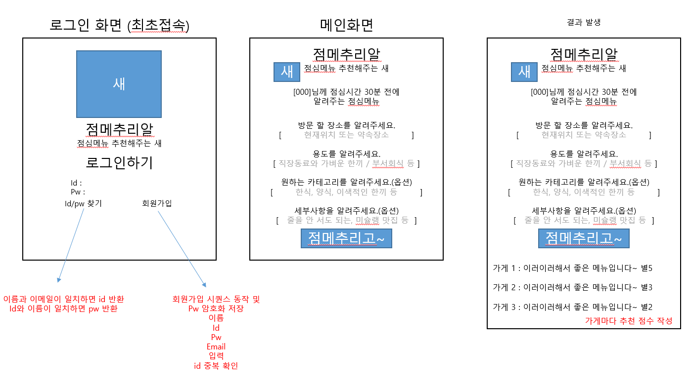

# 250610_first_project

### 1. 프로젝트 주제 : 점메추리 - 점심메뉴 추천 프로그램
1. 로그인 시에만 사용 가능하도록 구성  
2. 회원가입 및 로그인 기능 구현  
3. GPT API 연동하여 챗봇 기능 구현  
4. 챗봇이므로 스마트폰 UI 모양으로 구현  

---

### 2. WBS (Work Breakdown Structure)
| 날짜 | 작업 내용 |
|------|-----------|
| 10일(화) | 프로젝트 초기 세팅, FastAPI 백엔드 환경 구성, GPT API 구조 학습 |
| 11일(수) | 회원가입 / 로그인 기능 구현, 프론트엔드 구조 설계 및 UI 작업 |
| 12일(목) | 챗봇 기능 연동, 세션 기능 구현, UI 마무리 및 테스트 진행 |

---

### 3. 와이어프레임


---

### 4. 주요 기능 설명

#### ✅ 사용자 인증 기능
- **회원가입** 시 아이디 중복 검증, 비밀번호 형식(영문 + 특수문자 + 8자 이상) 검증 포함
- **로그인** 성공 시 쿠키에 사용자 정보 저장하여 세션 유지
- 비로그인 사용자는 챗봇 접근 불가 (리다이렉트 처리)

#### ✅ GPT 챗봇 기능
- FastAPI 비동기 처리로 Weniv에서 제공하는 GPT API와 통신
- 사용자의 질문에 대한 응답을 받아 채팅창에 출력
- "로딩 중..." 메시지와 함께 응답을 기다리는 UX 구현

#### ✅ 채팅 대화 유지
- 사용자의 대화 내용을 `localStorage`에 저장하여 새로고침해도 유지
- 로그인한 유저별로 대화 내용 분리 저장 → `localStorage['chatHistory_{username}']`

#### ✅ 프론트엔드 디자인
- **Tailwind CSS** 기반 스타일링  
- 챗봇 화면은 **모바일 UI**처럼 구성하여 직관적 사용성 제공  
- 배경은 그라데이션과 원형 장식을 사용해 감각적 톤앤매너 구현

#### ✅ 부가 기능
- `로그아웃` 버튼: 쿠키 삭제 및 로그인 화면으로 이동
- `초기화` 버튼: 현재 유저의 채팅 내역을 모두 삭제

---

### 5. 실행 방법

#### 📦 설치 및 실행

```bash
# 필수 패키지 설치
pip install fastapi uvicorn jinja2 httpx

# 서버 실행
uvicorn main:app --reload
